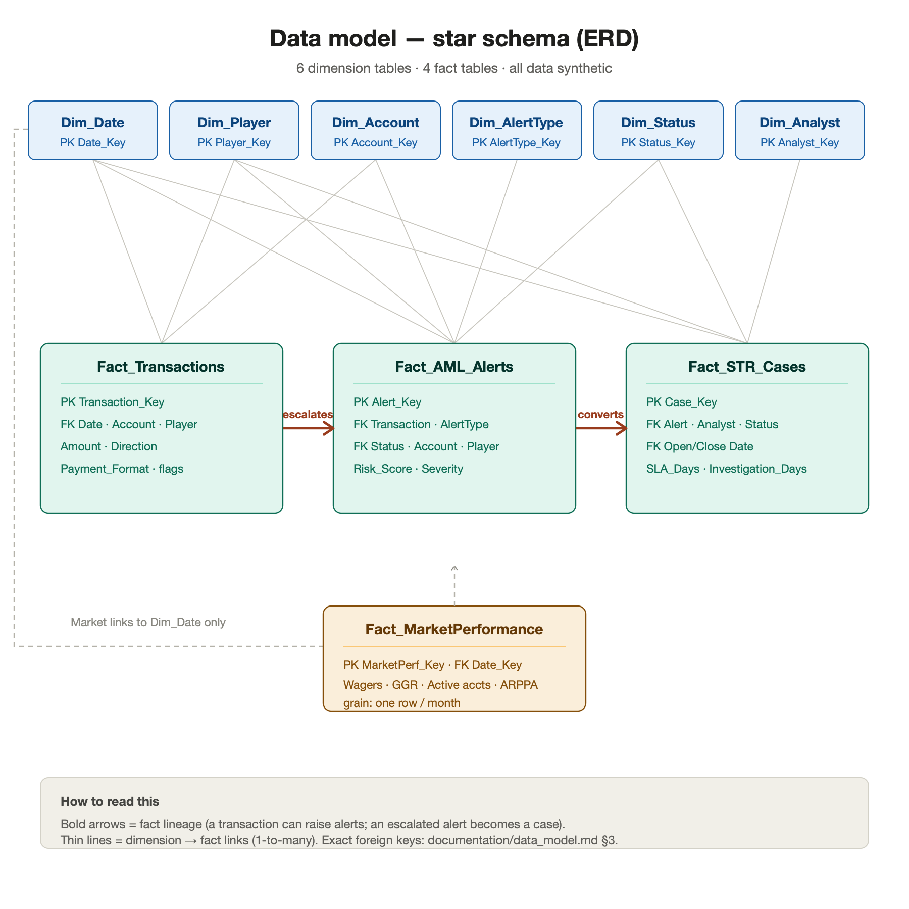

# Phase 2 — Data Model Design
## Gaming Compliance & Risk Intelligence Platform

---

## 1. Star Schema Overview

The model uses a **star schema** optimized for analytical reporting across four subject areas: AML transaction monitoring, STR case workflow, online gaming GGR reporting, and executive compliance reporting.

**Design principles:**
- **Conformed dimensions** — `Dim_Date` and `Dim_Account` are shared across multiple facts, enabling cross-subject analysis (e.g., alerts joined to transactions joined to market periods).
- **Surrogate keys** — every dimension uses an integer surrogate key (`*_Key`) as its primary key, decoupling the warehouse from source system natural keys.
- **Grain discipline** — each fact table is defined at a single, explicit grain (one row = one event).
- **Source transparency** — every column is tagged as **Source** (from the input datasets), **Derived** (calculated during ETL), or **Synthetic** (generated for the simulation).

```
                          ┌──────────────┐
                          │   Dim_Date   │
                          └──────┬───────┘
                                 │
        ┌────────────────┬───────┼────────┬─────────────────┐
        │                │       │        │                 │
┌───────▼──────┐  ┌──────▼─────┐ │ ┌──────▼──────┐  ┌────────▼────────┐
│ Dim_Account  │  │ Dim_Player │ │ │Dim_AlertType│  │   Dim_Status    │
└───────┬──────┘  └──────┬─────┘ │ └──────┬──────┘  └────────┬────────┘
        │                │       │        │                  │
        │   ┌────────────┘       │        │     ┌────────────┘
        │   │                    │        │     │   ┌──────────────┐
        │   │                    │        │     │   │ Dim_Analyst  │
        │   │                    │        │     │   └──────┬───────┘
   ┌────▼───▼─────────┐  ┌───────▼────────▼─────▼───┐      │
   │ Fact_Transactions│  │      Fact_AML_Alerts     │      │
   └──────────────────┘  └───────────┬──────────────┘      │
                                      │                     │
                          ┌───────────▼─────────────────────▼─┐
                          │          Fact_STR_Cases            │
                          └────────────────────────────────────┘

   ┌────────────────────────┐
   │ Fact_MarketPerformance │  ← links to Dim_Date only (monthly grain)
   └────────────────────────┘
```

---

## 2. Table-by-Table Data Dictionary

### 2.1 Dim_Date

**Business purpose:** Standard calendar dimension enabling time-based analysis, time intelligence, and period-over-period growth across all facts.

| Column | Data Type | Key | Source/Synthetic |
|---|---|---|---|
| Date_Key | INT | **PK** | Derived (YYYYMMDD format, e.g., 20240401) |
| Full_Date | DATE | | Derived |
| Day | TINYINT | | Derived |
| Month | TINYINT | | Derived |
| Month_Name | VARCHAR(20) | | Derived |
| Quarter | TINYINT | | Derived |
| Year | SMALLINT | | Derived |
| Year_Month | VARCHAR(7) | | Derived (e.g., "2024-04") |
| Day_Of_Week | VARCHAR(10) | | Derived |
| Is_Weekend | BIT | | Derived |
| Fiscal_Year | SMALLINT | | Derived |

**Example record:** `20240401 | 2024-04-01 | 1 | 4 | April | 2 | 2024 | 2024-04 | Monday | 0 | 2024`

**Grain:** One row per calendar day.

---

### 2.2 Dim_Account

**Business purpose:** Describes the financial/gaming accounts involved in transactions. A conformed dimension shared by `Fact_Transactions` and `Fact_AML_Alerts`.

| Column | Data Type | Key | Source/Synthetic |
|---|---|---|---|
| Account_Key | INT | **PK** | Derived (surrogate) |
| Account_ID | VARCHAR(50) | | Source (IBM account identifier) |
| Player_Key | INT | **FK** → Dim_Player | Derived |
| Account_Type | VARCHAR(30) | | Synthetic (e.g., Player Wallet, Bank, External) |
| Account_Open_Date | DATE | | Synthetic |
| Account_Status | VARCHAR(20) | | Synthetic (Active, Dormant, Closed) |
| Home_Bank | VARCHAR(50) | | Source (IBM "From/To Bank") |
| Risk_Rating | VARCHAR(10) | | Derived (Low/Medium/High from KYC simulation) |

**Example record:** `1001 | ACC-80021 | 552 | Player Wallet | 2023-02-14 | Active | Bank_07 | Medium`

**Grain:** One row per account.

---

### 2.3 Dim_Player

**Business purpose:** Describes the player (customer) behind one or more accounts. Supports KYC/customer-risk analysis and player-level AML aggregation.

| Column | Data Type | Key | Source/Synthetic |
|---|---|---|---|
| Player_Key | INT | **PK** | Derived (surrogate) |
| Player_ID | VARCHAR(50) | | Synthetic |
| Registration_Date | DATE | | Synthetic |
| Province | VARCHAR(30) | | Synthetic (default "Region-A") |
| KYC_Status | VARCHAR(20) | | Synthetic (Verified, Pending, Failed) |
| KYC_Risk_Level | VARCHAR(10) | | Synthetic (Low/Medium/High) |
| PEP_Flag | BIT | | Synthetic (Politically Exposed Person) |
| Self_Exclusion_Flag | BIT | | Synthetic (responsible gambling) |

**Example record:** `552 | PLR-00552 | 2023-02-10 | Region-A | Verified | Medium | 0 | 0`

**Grain:** One row per player. **Note:** A player may own multiple accounts (1-to-many → Dim_Account).

---

### 2.4 Dim_AlertType

**Business purpose:** Reference dimension defining the AML rules/typologies that can generate alerts. Drives "alerts by rule" analysis.

| Column | Data Type | Key | Source/Synthetic |
|---|---|---|---|
| AlertType_Key | INT | **PK** | Derived (surrogate) |
| Rule_Code | VARCHAR(20) | | Synthetic (e.g., AML-R01) |
| Rule_Name | VARCHAR(100) | | Synthetic |
| Typology | VARCHAR(50) | | Synthetic (Structuring, Velocity, etc.) |
| Default_Severity | VARCHAR(10) | | Synthetic (Low/Medium/High/Critical) |
| Base_Risk_Score | INT | | Synthetic (0–100) |
| Description | VARCHAR(255) | | Synthetic |

**Example record:** `3 | AML-R03 | Rapid Movement of Funds | Layering | High | 70 | Funds deposited and withdrawn within a short window`

**Grain:** One row per AML rule (≈10 rows, finalized in Phase 5).

---

### 2.5 Dim_Status

**Business purpose:** Reference dimension for case/alert lifecycle statuses, supporting STR workflow stage analysis.

| Column | Data Type | Key | Source/Synthetic |
|---|---|---|---|
| Status_Key | INT | **PK** | Derived (surrogate) |
| Status_Code | VARCHAR(20) | | Synthetic |
| Status_Name | VARCHAR(50) | | Synthetic (New, Under Review, Escalated, STR Submitted, Closed) |
| Status_Category | VARCHAR(20) | | Synthetic (Open, Closed) |
| Workflow_Order | TINYINT | | Synthetic (1–5 for funnel ordering) |
| Is_Terminal | BIT | | Synthetic (1 if end state) |

**Example record:** `4 | STR_SUB | STR Submitted | Open | 4 | 0`

**Grain:** One row per workflow status.

---

### 2.6 Dim_Analyst

**Business purpose:** Describes compliance analysts who own and work cases. Enables workload, productivity, and per-analyst SLA analysis.

| Column | Data Type | Key | Source/Synthetic |
|---|---|---|---|
| Analyst_Key | INT | **PK** | Derived (surrogate) |
| Analyst_ID | VARCHAR(20) | | Synthetic |
| Analyst_Name | VARCHAR(100) | | Synthetic (clearly fictional names) |
| Team | VARCHAR(50) | | Synthetic (AML Ops, Investigations, QA) |
| Seniority | VARCHAR(20) | | Synthetic (Junior, Senior, Lead) |
| Active_Flag | BIT | | Synthetic |

**Example record:** `7 | AN-007 | Jordan Vale (synthetic) | Investigations | Senior | 1`

**Grain:** One row per analyst.

---

### 2.7 Fact_Transactions

**Business purpose:** The core transactional fact — every money movement that AML rules evaluate. Sourced directly from IBM AML data.

| Column | Data Type | Key | Source/Synthetic |
|---|---|---|---|
| Transaction_Key | BIGINT | **PK** | Derived (surrogate) |
| Date_Key | INT | **FK** → Dim_Date | Derived from timestamp |
| Account_Key | INT | **FK** → Dim_Account (originating) | Derived |
| Counterparty_Account_Key | INT | **FK** → Dim_Account (receiving) | Derived |
| Player_Key | INT | **FK** → Dim_Player | Derived |
| Transaction_Timestamp | DATETIME | | Source |
| Amount | DECIMAL(18,2) | | Source |
| Currency | VARCHAR(3) | | Source |
| Payment_Format | VARCHAR(30) | | Source (e.g., Wire, ACH, Credit Card) |
| Transaction_Direction | VARCHAR(10) | | Derived (Deposit/Withdrawal) |
| Is_Laundering | BIT | | Source (IBM ground-truth label) |
| SourceSystem | VARCHAR(30) | | Derived (audit) |

**Example record:** `9000123 | 20240401 | 1001 | 1450 | 552 | 2024-04-01 14:22:00 | 8500.00 | CAD | Wire | Deposit | 1 | IBM_AML`

**Grain:** **One row per transaction.**

---

### 2.8 Fact_AML_Alerts

**Business purpose:** Records every alert raised by an AML rule against a transaction or account. The bridge between raw transactions and case investigations.

| Column | Data Type | Key | Source/Synthetic |
|---|---|---|---|
| Alert_Key | BIGINT | **PK** | Derived (surrogate) |
| Transaction_Key | BIGINT | **FK** → Fact_Transactions | Derived |
| AlertType_Key | INT | **FK** → Dim_AlertType | Derived (Phase 5 rules) |
| Account_Key | INT | **FK** → Dim_Account | Derived |
| Player_Key | INT | **FK** → Dim_Player | Derived |
| Date_Key | INT | **FK** → Dim_Date (alert date) | Derived |
| Status_Key | INT | **FK** → Dim_Status | Derived |
| Risk_Score | INT | | Derived (Phase 5 scoring) |
| Severity | VARCHAR(10) | | Derived |
| Alert_Timestamp | DATETIME | | Derived |
| Is_Escalated | BIT | | Derived |

**Example record:** `5500 | 9000123 | 3 | 1001 | 552 | 20240401 | 2 | 78 | High | 2024-04-01 14:25:00 | 1`

**Grain:** **One row per alert** (a transaction may trigger multiple alerts across rules).

---

### 2.9 Fact_STR_Cases

**Business purpose:** Tracks investigation cases from creation through STR submission/closure. The heart of the STR workflow and SLA reporting. **Largely synthetic** (case metadata simulated; linked to real alerts).

| Column | Data Type | Key | Source/Synthetic |
|---|---|---|---|
| Case_Key | BIGINT | **PK** | Derived (surrogate) |
| Alert_Key | BIGINT | **FK** → Fact_AML_Alerts | Derived |
| Analyst_Key | INT | **FK** → Dim_Analyst | Synthetic |
| Player_Key | INT | **FK** → Dim_Player | Derived |
| Status_Key | INT | **FK** → Dim_Status | Synthetic |
| Open_Date_Key | INT | **FK** → Dim_Date | Synthetic |
| Close_Date_Key | INT | **FK** → Dim_Date (nullable) | Synthetic |
| Case_Priority | VARCHAR(10) | | Synthetic |
| SLA_Days | INT | | Synthetic (target window) |
| Investigation_Days | INT | | Derived (close − open) |
| SLA_Breached | BIT | | Derived |
| STR_Submitted_Flag | BIT | | Synthetic |
| Closure_Reason | VARCHAR(50) | | Synthetic |

**Example record:** `7100 | 5500 | 7 | 552 | 4 | 20240401 | 20240412 | High | 10 | 11 | 1 | 1 | STR Filed with FINTRAC (synthetic)`

**Grain:** **One row per investigation case.**

---

### 2.10 Fact_MarketPerformance

**Business purpose:** Monthly synthetic market metrics for GGR reporting and executive dashboards. Generated by the synthetic data generator (illustrative figures). Stands apart from the AML facts — connects only to `Dim_Date`.

| Column | Data Type | Key | Source/Synthetic |
|---|---|---|---|
| MarketPerf_Key | INT | **PK** | Derived (surrogate) |
| Date_Key | INT | **FK** → Dim_Date (month start) | Derived |
| Reporting_Period | VARCHAR(7) | | Source (e.g., "2024-04") |
| Total_Wagers | DECIMAL(18,2) | | Synthetic (market series) |
| Total_GGR | DECIMAL(18,2) | | Synthetic (market series) |
| Active_Player_Accounts | INT | | Synthetic (market series) |
| GGR_Per_Active_Account | DECIMAL(18,2) | | Derived |
| Hold_Percentage | DECIMAL(5,2) | | Derived (GGR / Wagers) |
| MoM_GGR_Growth | DECIMAL(6,2) | | Derived |
| SourceSystem | VARCHAR(30) | | Derived ("Synthetic_Market") |

**Example record:** `13 | 20240401 | 2024-04 | 1450000000.00 | 56000000.00 | 360000 | 155.56 | 3.86 | 2.10 | Synthetic_Market`

**Grain:** **One row per reporting month.**

---

## 3. Relationship Map



*Star / constellation schema. The three core facts form a lineage (transaction → alert →
case); `Fact_MarketPerformance` joins only to `Dim_Date`. The exact foreign keys follow.*

| Parent (PK) | Child (FK) | Cardinality |
|---|---|---|
| Dim_Date → | Fact_Transactions, Fact_AML_Alerts, Fact_STR_Cases (×2), Fact_MarketPerformance | 1-to-many |
| Dim_Account → | Fact_Transactions (×2: originating + counterparty), Fact_AML_Alerts | 1-to-many |
| Dim_Player → | Dim_Account, Fact_Transactions, Fact_AML_Alerts, Fact_STR_Cases | 1-to-many |
| Dim_AlertType → | Fact_AML_Alerts | 1-to-many |
| Dim_Status → | Fact_AML_Alerts, Fact_STR_Cases | 1-to-many |
| Dim_Analyst → | Fact_STR_Cases | 1-to-many |
| Fact_Transactions → | Fact_AML_Alerts | 1-to-many |
| Fact_AML_Alerts → | Fact_STR_Cases | 1-to-many |

**Role-playing dimension note:** `Dim_Date` plays multiple roles (transaction date, alert date, case open date, case close date) and `Dim_Account` plays two roles in `Fact_Transactions` (originating + counterparty). In Power BI these are handled via active/inactive relationships or `USERELATIONSHIP`.

---

## 4. ERD Description

The model is a classic star with two layers of fact dependency reflecting the compliance lifecycle:

1. **Transaction layer** — `Fact_Transactions` sits at the center, surrounded by `Dim_Date`, `Dim_Account`, `Dim_Player`.
2. **Alert layer** — `Fact_AML_Alerts` references a transaction and adds `Dim_AlertType`, `Dim_Status`.
3. **Case layer** — `Fact_STR_Cases` references an alert and adds `Dim_Analyst`, plus `Dim_Status` and `Dim_Date` in role-playing form.
4. **Market layer** — `Fact_MarketPerformance` is a standalone monthly fact joined only to `Dim_Date`, intentionally decoupled (different grain, different source).

This produces a connected chain — **Transaction → Alert → Case** — that mirrors the real AML escalation path, while market reporting runs in parallel for the executive view.

---

## 5. Data Grain Explanation

| Table | Grain |
|---|---|
| Fact_Transactions | One row per individual transaction |
| Fact_AML_Alerts | One row per alert (transaction × rule) |
| Fact_STR_Cases | One row per investigation case |
| Fact_MarketPerformance | One row per reporting month |

The grain mismatch between the daily/transactional AML facts and the **monthly** market fact is deliberate. They are never joined directly at row level — they meet only at the aggregated executive layer through `Dim_Date` (rolled up to month).

---

## 6. Assumptions and Limitations

**Assumptions**
- IBM AML transaction structure maps cleanly to deposit/withdrawal semantics for an online gaming wallet model.
- One player maps to one or more accounts; the IBM data's account IDs are treated as belonging to synthetic players.
- synthetic monthly market data are loaded at month grain with `Date_Key` set to the first of the month.
- `Is_Laundering` from IBM is used as ground truth for validating AML rule precision/recall in later phases.

**Limitations**
- `Dim_Player`, `Dim_Analyst`, `Dim_Status`, and most of `Fact_STR_Cases` are **synthetic** — they simulate a compliance operation that the public datasets do not provide.
- The model does not include a customer-transaction balance/ledger; it focuses on event-level monitoring, not full accounting.
- No slowly-changing-dimension (SCD) history is modeled in this version — dimensions are treated as current-state (**SCD Type 1**), which is acceptable for a portfolio build. **Future enhancement:** convert the compliance-relevant attributes to **SCD Type 2** so their history is preserved — specifically **player risk rating**, **KYC status**, and **account status**. In real compliance analytics, *when* a player's risk rating or KYC state changed is often as important as its current value (e.g., "was this account High-risk at the time of the flagged transaction?"), so Type 2 history with effective-dated rows would make the model materially more realistic.
- Currency is captured but the model assumes CAD-normalized amounts for reporting; FX conversion is out of scope.

---

## 7. Recommended Next Phase

**Phase 3 — SQL Database & Analytics Foundation** (Cursor)

Implement this model as production-quality SQL: `CREATE TABLE` scripts with constraints and keys, staging tables, data-quality checks, reporting views, and test data — organized under `/sql`.

Prompt file: [`ai_prompts/03_SQL_Database_Analytics_Foundation.md`](ai_prompts/03_SQL_Database_Analytics_Foundation.md)
